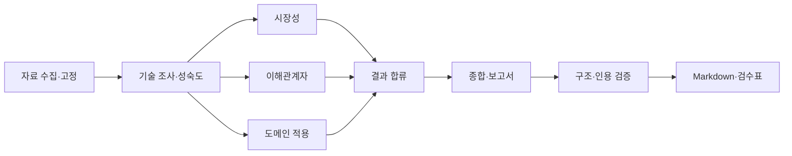

# KV Cache 다관점 평가 에이전트

기업 IT 사업 문서 검토를 지원하는 Agentic AI를 적용 시나리오로 삼아 **KIVI와 InfiniGen의 선택 조건을 비교하는 보고서 생성기**입니다. KIVI는 KV 캐시를 양자화해 저장량을 줄이고, InfiniGen은 CPU의 KV 중 필요한 항목을 GPU로 가져옵니다. 논문과 공식 자료를 검색해 기술 성숙도·시장성·이해관계자·도메인 적용을 평가합니다.

[설계서](docs/design-report.md) · [평가 보고서](reports/latest/report.md) · [인용 검수표](reports/latest/citation_review.md) · [실행 검증](docs/validation.md)

## 실행

Python 3.11~3.13과 [uv](https://docs.astral.sh/uv/)를 사용합니다. 모델과 패키지는 최초 준비 시 내려받습니다.

```bash
uv sync --frozen
cp -n .env.example .env.local
# .env.local의 OPENAI_API_KEY와 USD_TO_KRW를 입력합니다.
uv run python app.py --prepare
uv run python app.py
```

`--prepare`는 공개 자료 수집과 로컬 임베딩을 수행합니다. 일반 실행은 GPT API를 사용하므로 비용이 발생합니다. `.env.local`을 읽으며 같은 이름의 셸 환경변수가 우선합니다. 기본 모델은 `gpt-5.6-luna`, 기본 추론은 질의·수정 `low`, 조사·관점 `medium`, 종합 `max`이며 출력 상한은 64,000토큰입니다. 모델·단가는 [가격 확인 기록](docs/pricing.md)과 연결해 검사합니다.

```bash
uv run python -m pytest -q                    # API 없이 회귀 검사
uv run python scripts/evaluate.py            # 준비한 인덱스의 검색 검사
uv run python app.py --render outputs/<실행ID> # 저장한 결과로 Markdown 재작성
uv run python app.py --resume outputs/<실행ID> # 동일 코드·입력의 완료 응답 재사용
```

코드를 수정한 뒤에는 `--reuse-calls outputs/<실행ID>`를 사용할 수 있습니다. 자료·검색 정책·모델·설정·의존성·공개 보고서 명세가 같아야 하며, 정확히 같은 요청의 정상 완료 응답만 재사용합니다. 변경된 요청은 새로 생성하고 현재 검증을 다시 거칩니다. 조건이 달라졌으면 복구 옵션 없이 새로 실행합니다.

결과는 `outputs/<실행ID>/`의 `report.md`, `citation_review.md`, `gap_review.md`에 저장됩니다. 주장·인용·출처·실행 설정도 JSON으로 보존합니다. `human_review_pending`은 생성과 자동 검증을 마치고 인용 의미 검수를 기다리는 상태입니다. 프로그램과 `--render`는 Markdown만 생성하며 PDF는 생성하지 않습니다. 팀이 내용 검수 후 PDF로 변환합니다. 저장 루트는 `RAG_OUTPUT_DIR`로 바꿀 수 있습니다.

`reports/latest/`는 검토·편집한 공유용 사본으로, 새 실행 때 자동 갱신되지 않습니다. 새 결과를 공유할 때는 해당 실행의 보고서와 두 검수표를 함께 검토해 옮기고 `run.json`의 실행 ID와 파일 해시를 갱신합니다. 실행 원본은 `outputs/<실행ID>/`에 보존합니다.

제출용 PDF: [설계서](output/pdf/RAG-Design_판교-7반_김기현+김도현+박병준+홍수정.pdf) · [평가 보고서](output/pdf/RAG-Output_판교_7반_김기현+김도현+박병준+홍수정.pdf). PDF의 상세 검수 링크는 팀 점검용 스냅샷 저장소로 연결됩니다.

## 역할과 흐름



| 역할 | 판단과 결과 |
| --- | --- |
| 기술 조사·성숙도 | 기술별 원리·한계·실험조건·잠정 TRL을 정리하고 공통 근거를 전달 |
| 시장성 | 기술별 채택 동기·대안·도입 및 운영 비용 비교 |
| 이해관계자 | 문서 검토자·운영자·구매 및 보안 담당자의 효익과 부담 비교 |
| 도메인 적용 | 같은 문서 업무의 적합 조건·위험·검증 실험 제안 |
| 종합·보고서 | 관점별 주장을 배치하고 이익과 부담의 상충, 선택 조건과 근거 공백 정리 |

LangGraph가 선행 조사, 세 관점의 병렬 평가, 합류와 종료를 제어합니다. 기술 조사는 두 기술을 최대 2개, 후속 평가는 최대 3개 동시 호출로 처리합니다. 각 역할은 질문·입력·응답 구조·검증 규칙을 따로 사용하고 모델 호출과 예산 관리는 공유합니다.

기술 조사는 논문을 **벡터 검색**합니다. 후속 세 관점도 관점별 질의로 고정된 공식 웹 자료를 **어휘 검색**하고 공통 논문 근거와 함께 사용합니다. 부족한 이유를 바탕으로 질의를 한 번 수정하는 검색·재평가 절차가 있습니다. 실제 사내 문서를 검색하거나 RFP를 검토하는 서비스는 이 보고서 생성기의 구현 범위에 포함되지 않습니다.

## 자료와 검색

KIVI 15페이지와 InfiniGen 18페이지를 물리 페이지 단위로 추출합니다. PDF 처리 상한은 총 200페이지입니다. 출처별 버전·원문 해시·추출문과 페이지를 보존합니다. 공식 웹은 등록된 시작 URL의 허용 host/path 안에서 깊이 1, 시작점별 최대 3건·전체 6건으로 확장합니다. 문서 5MB·전체 20MB·요청 30초를 제한하며 리디렉션도 검사합니다. 자료 수집이 끝나면 실행 중에는 고정 사본을 검색합니다.

임베딩은 CPU에서 `intfloat/multilingual-e5-small`을 실행합니다. `query:`와 `passage:` 접두사, 384차원 정규화 벡터, 코사인 유사도를 사용합니다. 현재 청크는 300토큰·겹침 50토큰, 질의별 상위 후보는 5개입니다. 두 논문은 175개 청크로 구성됩니다.

[E5·BGE 비교 실험](docs/retrieval-experiments.md)에서 E5 300/50을 선택했습니다. 2,000 E5토큰 문맥 기준 등록 구절 완전 회수는 선택용 16문항에서 14/16, 마지막 검증 8문항에서 7/8이었습니다. 이는 등록한 원문 구절의 회수율이며 모든 질문의 의미적 정답률이나 기업 문서의 검색 성능을 뜻하지 않습니다. [초기 E5·MiniLM 비교](docs/embedding-benchmark.md)도 별도 기록으로 보존합니다.

[운영 문맥 진단](docs/context-retrieval.md)에서는 네 질문을 합친 연구 문맥과 후속 관점의 인용 전달을 따로 측정했습니다. 표·그림 설명과 같은 출처의 실험 설정 청크를 보완합니다. 실제 질문 묶음에서 누락된 핵심 조건을 회수했지만, 질문과 인용 구성이 달라지면 일부 조건이 문맥 예산에서 밀립니다. 이미 확인한 실패 사례를 이용한 진단이며, 미회수 구절과 정책별 차이를 원시 결과에 기록합니다.

## 입력 한도와 비용

입력은 생성 전에 제공자 API로 계수합니다. 24,000토큰에서 프로토콜 여유 512를 뺀 23,488토큰을 상한으로 두고, 최초 구조화 요청에는 수정 지시 여유 512를 추가로 확보합니다. 초과 입력은 생성 전에 중단합니다. 후속 관점 재평가는 세부 질문별 최대 세 개 요청으로 나눌 수 있으며, 각 요청에 전체 원문을 유지합니다. 분할 요청이 모두 입력 검사를 통과하면 병렬 생성합니다. 공유 Gateway가 전체 생성 호출을 최대 3개로 제한합니다.

인용·주장 필드·보고서 배치 오류는 해당 부분만 수정합니다. 충분한 기존 주장과 원문은 코드가 보존하고, 합친 응답에 전체 검증을 다시 적용합니다. 한 라운드의 독립 수정은 최대 8개이며 모든 수정 입력을 먼저 검사합니다. 같은 ID와 같은 내용의 청크만 중복 제거합니다.

누적 내부 집행 한도는 45,000원, 팀 예산은 50,000원입니다. 호출 전 최대 비용을 예약하고 실제 사용량으로 정산합니다. 시간 초과처럼 청구 여부가 불명확하면 자동 재전송 없이 예약액을 유지합니다. 429 응답만 제한적으로 재시도합니다. **유료 실행은 담당자 한 명의 환경에서 같은 `.local/usage.json` 장부를 사용합니다.** 다른 컴퓨터나 프로그램의 비용은 자동 집계되지 않습니다. 장부를 초기화하거나 실행별로 나누지 않습니다.

## 코드 구성

| 경로 | 책임 |
| --- | --- |
| `app.py`, `rag/graph.py`, `rag/schemas.py` | 실행 진입점, 역할별 그래프, 공유 State와 구조화 응답 |
| `rag/corpus.py`, `rag/source_discovery.py` | 원문 수집·청킹·임베딩·검색·출처 관리 |
| `rag/llm.py`, `rag/budget.py`, `rag/request_budget.py`, `rag/repair.py` | API 호출·입력 한도·비용·제한된 오류 수정 |
| `rag/evidence.py`, `rag/render.py` | 주장·인용·보고서 구조 검증과 Markdown 작성 |
| `config/`, `eval/`, `tests/` | 실행·보고서 명세, 고정 검색 질문, 회귀 검사 |
| `scripts/`, `experiments/` | 로컬 검색 실험 도구와 측정 결과 |
| `docs/`, `reports/latest/` | 설계·기술 기록과 최신 보고서·검수표 |

## 검수와 한계

인용 구절이 원문에 존재하는지와 그 구절이 주장 전체를 뒷받침하는지는 다른 질문입니다. 자동 검사는 구절·출처·페이지 연결, 주장 누락·중복, 본문 순서와 요약 개수를 확인합니다. 팀은 인용 검수표에서 실험조건과 해석을, 공백 검수표에서 해소 판정을 확인합니다.

공개 자료로 확인한 실험과 기업 업무에 대한 적용 가정을 구분합니다. 이 프로젝트는 KIVI·InfiniGen 자체의 성능을 재현하지 않으며, 서로 다른 실험 수치로 우열을 단정하지 않습니다. 최종 PDF의 SUMMARY 반 페이지, 한글·표·페이지 배치도 별도로 확인합니다.

## Contributors

| 팀원 | 수행 역할 |
| --- | --- |
| 김기현 | README 재현·PDF 형식·발표 정리 |
| 김도현 | PDF 자료 처리·임베딩·검색·출처 도구 |
| 박병준 | 그래프·State·모델 호출·최종 통합 |
| 홍수정 | 원문·질문셋·관점별 주장·조건 검수 |

Codex를 코드·문서 초안 작성과 검증 도구 제작에 활용했습니다. 팀은 위 담당 영역을 검토하고 결과와 근거를 확인합니다.

## Lessons Learned

- 표의 수치와 실험 설정이 다른 페이지에 놓일 수 있습니다. 구절 회수뿐 아니라 조건을 함께 전달하는지 확인해야 합니다.
- 원문을 잘라 입력 한도를 맞추면 비교 기준을 잃을 수 있습니다. 완전한 청크를 선택하고 오류가 있는 부분만 수정하는 방식으로 요청 크기를 관리했습니다.
- 추론 토큰도 출력 한도와 비용을 사용합니다. 본문 없이 종료된 호출을 포함해 사용량과 미정산 예약을 누적해야 합니다.
- 관점별 근거가 충분해도 종합 결론은 약할 수 있습니다. 최종 판단에서 누구의 이익이 누구의 부담으로 이어지는지 연결해야 합니다.
