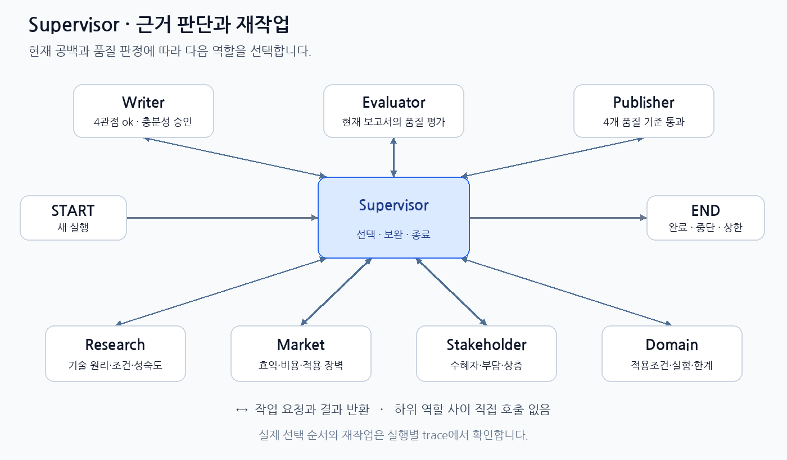

# Subject

본 프로젝트는 KV cache 최적화 기술을 소프트웨어와 하드웨어·시스템 관점에서 선정하고, 기술 성숙도·시장성·이해관계자·도메인 적용 관점으로 평가하는 **Supervisor 패턴 기반 LangGraph Agent** 프로젝트입니다.

## Overview

- **Objective** : KIVI와 InfiniGen의 근거·조건·한계를 여러 관점에서 비교하여 기업 IT 사업 문서 검토 시나리오의 적용 후보를 평가합니다.
- **Pattern** : Supervisor가 근거의 충분성과 보고서 품질을 판단하고, 필요한 관점에 재조사·수정을 요청합니다. 중앙에서 상태와 재개를 관리하기 쉽지만 조정 호출과 직렬 처리에 시간이 듭니다.
- **동적 처리** : 기술 조사 후 시장성·이해관계자·도메인 조사 순서는 현재 공백에 따라 선택합니다. 네 관점의 근거가 충분해야 작성하며, 평가 실패 시 지정 관점 또는 Writer로 돌아갑니다.
- **시나리오** : 공개 SK AX AiPMO 설명을 참고한 RFP·계약·사업 문서 검토입니다. 장문·반복 요청과 KIVI·InfiniGen 적용은 팀이 설정한 실험 가정입니다.

최근 실행에서 보고서 작성·품질 평가·재조사를 확인했습니다. [제출 보고서](docs/evaluation-report.md)는 실행 결과에 원문 검토와 편집을 반영했습니다. [실행 결과와 검증 상태](docs/integration-status.md)에서 실제 처리 경로를 확인할 수 있습니다.

## Selected Technologies

- **SW : KIVI** — KV cache의 키와 값 특성에 맞춘 저비트 양자화입니다. 메모리 사용과 정확도의 관계를 소프트웨어 관점에서 평가하기 위해 선정했습니다. [논문 v2](https://arxiv.org/abs/2402.02750v2)
- **HW : InfiniGen** — CPU–GPU 메모리 계층과 데이터 전송을 함께 다루는 동적 KV cache 관리 시스템입니다. 연산·메모리·전송의 제약을 평가하기 위해 선정했습니다. [논문 v1](https://arxiv.org/abs/2406.19707v1)

두 기술은 각 논문의 모델·장비·워크로드 조건에 따라 평가합니다.

## Features

- PDF 페이지·웹 스냅샷에서 정보를 추출하고, 주장→인용→청크→원문 위치를 연결합니다.
- 기술 성숙도·시장성·이해관계자·도메인 적용을 조사하고, 부족한 근거를 추가 검색합니다.
- **확증 편향 방지 전략** : 기술별 장점과 한계, 적용 조건과 반대 근거를 함께 조사합니다. 사실·저자 보고·팀 추론·시나리오·미확인을 구분하고 상충하는 이해관계를 보존합니다.
- **보고서 품질 평가** : 코드의 구조·인용 검사와 LLM Judge를 결합해 근거성, 중립성, 편향 통제, 관점 포함 여부를 판정합니다. 구조·인용 검사와 네 품질 기준을 모두 충족해야 통과합니다.
- 현재 보고서와 평가가 일치하고 네 기준을 통과해야 Markdown·PDF·인용 검수표를 출력합니다. PDF는 10페이지 이하로 구성합니다.
- 실행 상태와 비용 장부를 저장합니다. 완료 여부가 불명확한 호출은 자동 반복하지 않습니다.

## Tech Stack

- **Framework** : LangGraph · Python 3.11–3.13 · Pydantic
- **LLM / Generator** : `gpt-5.6-luna` — 현재 설정. 조사·Supervisor는 `medium`, Writer는 `max` 추론 설정을 사용합니다.
- **LLM / Judge** : `gpt-5.6-luna` · `max` — 생성과 분리된 평가 프롬프트를 사용합니다.
- **Retrieval** : 로컬 NumPy 벡터 검색(`vectors.npy`, `index.json`), 운영 K=5. 영어 24문항의 저장 순위 재집계에서 **Hit Rate@5 87.5%, MRR@5 0.6194**입니다. 평가 범위는 알려진 질문의 검색 순위입니다. [정의·측정 범위](docs/retrieval-metrics.md)
- **Embedding** : 오픈소스 `intfloat/multilingual-e5-small` · CPU · 384차원. revision `614241f622f53c4eeff9890bdc4f31cfecc418b3`, 청크 300토큰·중첩 50토큰입니다.
- **Parsing / Output / Tracing** : PyPDF · Beautiful Soup · ReportLab · LangSmith. LangSmith에는 허용된 실행 메타데이터를 보내고 원문·프롬프트·보고서 본문은 로컬에 보관합니다.

## Agents

| 역할 | 책임 |
| --- | --- |
| Supervisor | 현재 결과와 공백으로 다음 역할을 선택하고 충분성·재작업·종료를 관리 |
| Research Agent | KIVI·InfiniGen의 원리, 실험 조건, 한계, 기술 성숙도 조사 |
| Market Agent | 효익, 비용, 적용 장벽 평가 |
| Stakeholder Agent | 수혜자, 부담 주체, 이해관계 충돌 평가 |
| Domain Agent | 문서 검토 시나리오의 적용조건, 검증 실험과 한계 평가 |
| Writer | 네 관점의 검증된 주장과 근거로 종합 보고서 작성·수정 |
| Evaluator | 코드 검사와 LLM Judge로 네 품질 기준 평가·보완 대상 지정 |
| Publisher | 통과한 현재 보고서를 검증하고 Markdown·PDF·검수 문서 저장 |

하위 역할의 결과는 모두 Supervisor로 돌아옵니다. 노드 사이의 입력·출력은 [공통 계약 v1](docs/agent-contract.md)을 따릅니다.

## State Schema

| 설계 항목 | 구현과 이유 |
| --- | --- |
| 제어 vs 페이로드 분리 | State에는 상태·다음 작업·시도수·요약·파일 참조를 둡니다. 원문과 완전한 역할 결과는 별도 파일에서 읽습니다. |
| 관측성 위치 | 판단 이유와 결정 전문은 로컬 결과·이벤트에 저장하고, 외부 추적에는 제한된 메타데이터만 보냅니다. |
| 지속성 비용 | snapshot에는 최신 결과 참조만 저장하고 64 KiB 상한을 적용합니다. 과거 결과는 별도 파일에 보존합니다. |
| 상관 | 실행 전체의 `run_id`, 역할·시도별 `request_id`, `attempt`로 요청·응답·평가·출력을 연결합니다. |
| 재개/복구 | 호출 전 pending을 저장하고 완료 결과의 해시를 확인합니다. 코드·설정·자료·비용 장부가 달라지면 재개를 거부합니다. 완료 불명 호출은 `needs_attention`으로 남깁니다. |
| 동시 처리 | Supervisor의 State 갱신은 직렬입니다. 역할 내부에서 독립 조사를 병렬 실행하며, 같은 실행 폴더의 동시 접근은 잠금으로 막습니다. |
| 종료 보장 | 조사 역할별 2회, Writer 3회, Supervisor 24회가 기본 상한입니다. 상한에 걸리면 `incomplete`로 종료합니다. |

## Architecture



[컴파일된 그래프](docs/supervisor-graph.mmd) · [Supervisor 구현](agents/supervisor.py) · [실제 실행 경로](docs/integration-status.md)

## Directory Structure

```text
├── data/                  # PDF·웹 스냅샷·출처 목록
├── agents/                # 계약·State·Supervisor·관점 조사
│   └── researchers/       # 기술 조사·관점 평가·재검색
├── rag/                   # 검색·모델 호출·Writer·Evaluator·출력
├── prompts/               # 프롬프트 템플릿
├── config/                # 시나리오·자료·보고서 계약
├── eval/                  # 검색 평가 질문과 기준 결과
├── scripts/               # 검색 검증·제출물 구성
├── tests/                 # 계약·라우팅·근거·복구·출력 검사
├── docs/                  # 계약·설계·측정 방법
├── assets/fonts/          # PDF 한글 글꼴
├── outputs/               # 실행별 상태·중간 결과·보고서
├── app.py                 # 준비·실행·재개 진입점
├── pyproject.toml
├── uv.lock
└── README.md
```

## Usage

저장소 루트에서 실행합니다. `uv sync --frozen`으로 고정된 의존성을 설치한 뒤 환경 파일을 준비합니다.

```bash
uv sync --frozen
cp -n .env.example .env.local
```

`.env.local`에 API 키, 환율·단가 확인일, 제출 정보를 입력합니다. 같은 이름의 셸 환경변수가 있으면 그 값이 우선합니다. 현재 비용 검사는 `gpt-5.6-luna` Standard 계약에 고정돼 있으므로 다른 모델을 쓰려면 가격 계약과 검증도 갱신해야 합니다.

```bash
# 공개 자료 다운로드·로컬 임베딩·검색 회귀 확인: GPT 생성 호출 없음
uv run python app.py --prepare

# Supervisor Agent 실행
uv run python app.py --agent

# 같은 코드·설정·자료·장부에서 중단한 실행 재개
uv run python app.py --agent --agent-resume outputs/<실행ID>

# 로컬 검사
uv run pytest -q
```

옵션 없는 `app.py`는 보존된 RAG 경로를 실행합니다. Agent 실습에서는 `--agent`를 지정합니다. 과거 실행 안내와 실험 기록은 [기존 RAG 안내 보관본](docs/rag-legacy-guide.md)에 있습니다.

## Lessons Learned

RAG에서 인용문을 찾았다는 사실만으로 그 인용이 주장을 뒷받침한다고 볼 수는 없습니다. 실제 실행에서는 인용 문자열 검사를 통과한 뒤에도 고정 변수와 변경 변수를 혼동하거나 서로 다른 실험의 조건을 합치는 오류가 발생했습니다. 모델명이 잘린 검색 발췌를 근거로 모델을 특정하고, 운영상 예상 위험을 논문의 측정 결과로 분류한 사례도 있었습니다.

최종 품질 평가는 이러한 오류를 발견해 발행을 막았습니다. 하지만 기술 조사에서 나온 주장이 여러 관점에 재사용된 뒤였고, 보완 과정에서 생성 호출 상한에 도달해 자동 PDF 발행까지 완료하지 못했습니다. 모델의 생성 오류와 함께, 근거 문맥의 구성·검증 시점·재작업 범위가 결과와 비용에 영향을 주었습니다.

이 경험에서 얻은 개선 원칙은 다음과 같습니다.

- **인용 연결과 주장 지지를 따로 확인한다.** 원문에 인용문이 존재하는지뿐 아니라 해당 주장과 실험 조건을 실제로 뒷받침하는지 검토합니다.
- **실험 조건을 묶어서 보존한다.** 모델·데이터셋·배치·측정값의 출처를 같은 실험 단위로 연결하고, 발췌에서 확인되지 않는 조건은 다른 실험에서 가져와 채우지 않습니다.
- **다른 에이전트에 전달하기 전에 검증한다.** 초기 조사 오류가 여러 관점으로 퍼지지 않도록 검증 위치를 앞당기되, 보고서 작성 후 품질 평가는 유지합니다.
- **실패한 주장과 영향을 받은 부분만 수정한다.** 해석 오류와 검색 근거 부족을 구분하고, 작성·최종 평가에 필요한 호출 여유를 확보합니다.

위 항목은 이번 실패에서 정한 개선 방향입니다. 구조 개선과 실제 실행의 검증 상태는 [현재 작업 기록](docs/integration-status.md#근거-전파복구-구조-개선-계획)에서 관리합니다.

## Contributors

- **김기현** : 네 관점 Research Agent, 근거 수집·재조사, 조사 결과 검증
- **김도현** : Writer, Hybrid Evaluator, 보고서 구조·품질 판정
- **박병준** : 공통 계약·State·Supervisor, 팀 PR 통합, 통합 검증·보완
- **홍수정** : Publisher, 실행·재개 연결, LangSmith 추적, PDF·제출물 구성
