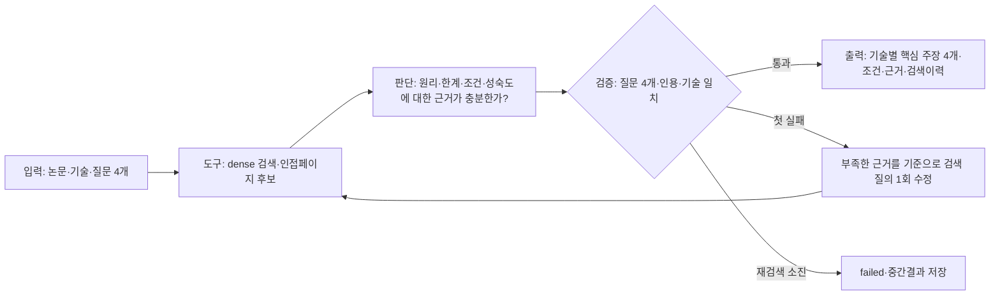
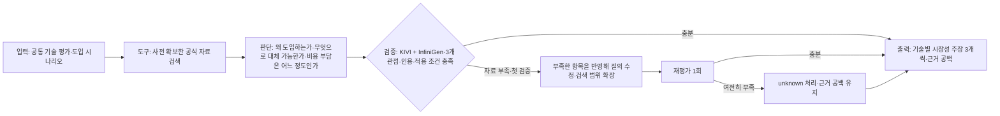
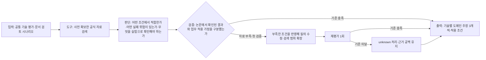
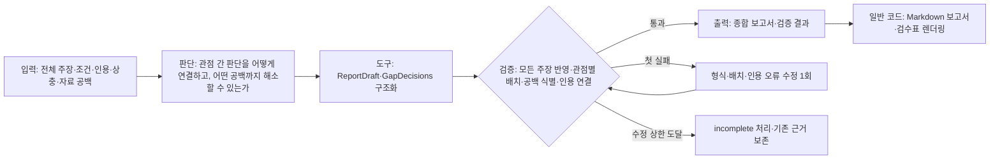
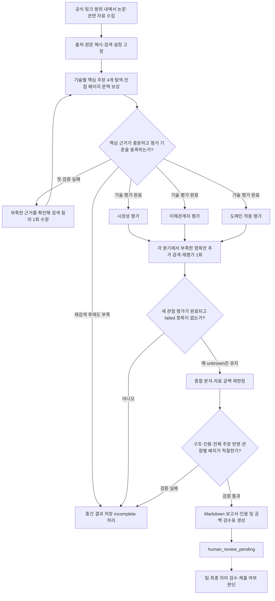
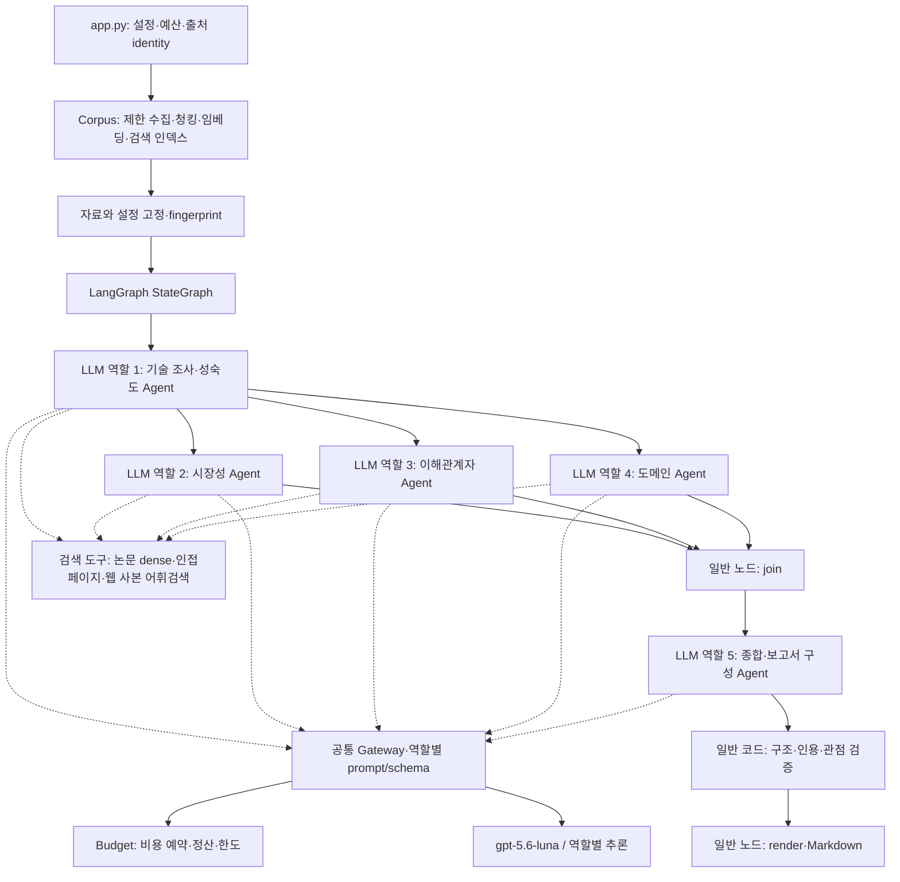

# 기업 IT 사업 문서 검토를 위한 KV Cache 기술 평가 에이전트 설계(안)

판교 7반 6조 / 김기현, 김도현, 박병준, 홍수정

## **1. 문제 정의**

기업의 IT 사업 문서를 검토할 때는 RFP(Request for Proposal), 계약서, 사업 문서에 흩어진 요구사항을 함께 읽어야 한다. 이를 지원하는 언어 모델 서비스는 긴 문맥을 반복해서 처리하므로 메모리 사용량과 응답 지연이 중요한 설계 조건이다. 우리는 공개된 [SK AX AiPMO의 문서 검토 업무](https://www.skax.co.kr/insight/trend/3870)를 참고해 장문·반복 요청을 KV Cache Optimization 기술의 공통 적용 시나리오로 정했다.

KV Cache는 언어 모델이 이전 토큰의 계산 결과를 재사용하기 위해 저장하는 데이터다. 문맥이 길어지면 캐시가 커지고, GPU 메모리에 보관할 양과 다른 메모리에서 가져올 데이터의 양이 함께 문제가 된다. 캐시를 줄이면 정확도에 영향을 줄 수 있고, 저장 공간을 CPU로 넓히면 전송과 관리 비용이 생길 수 있다.

이 프로젝트의 목표는 **두 KV Cache 기술을 같은 근거와 평가 기준으로 비교하는 보고서 생성 시스템**을 만드는 것이다. 보고서는 각 기술의 메모리 절감 방식이 정확도와 응답 지연에 어떤 영향을 주는지 설명하고, 기술 성숙도·시장성·이해관계자·도메인 적용 관점에서 선택 조건을 제시한다.

## **2. KV Cache Optimization 기술 선정**

비교 기술은 **같은 KV Cache 문제를 다루되 해결 수단이 다르고, 원리와 실험조건을 원문에서 추적할 수 있어야 한다**는 기준으로 선정했다.

| **구분** | **선정 기술** | **선정 근거** | **비교시 확인할 질문** |
| --- | --- | --- | --- |
| SW 압축 | KIVI | Key와 Value의 특성에 맞춰 서로 다른 축으로 양자화하는 기술이다. 장문 추론에서 저장할 KV의 크기를 줄이는 접근을 대표하며, 비트폭, 잔여 고정밀 캐시, 정확도의 관계를 구체적으로 살펴볼 수 있다. |   • 메모리 절감이 문서 검토 정확도에 어떤 부담을 주는가?<br>• 모델, 비트폭, 잔여 캐시 설정에 따라 판단이 달라지는가? |
| HW·메모리 계층 | InfiniGen | CPU에 보관한 KV 중 필요한 항목을 예측해 GPU로 가져오는 기술이다. GPU 용량뿐 아니라 CPU 메모리와 연결 대역폭을 사용하는 접근이므로, 장문 처리에서 저장 위치, 데이터 전송, 선택 정확도의 관계를 분석할 수 있다. |   • GPU 메모리 부담을 줄이는 대신 어떤 전송, 운영 조건이 필요한가?<br>• 필요한 KV를 선택하는 과정이 문서 검토 품질에 어떤 검증 과제를 만드는가? |

비교 대상은 설계 단계에서 KIVI와 InfiniGen으로 고정했다. 에이전트는 이 두 기술의 조사, 평가, 종합을 수행하며, 각 실행은 같은 비교 대상과 평가 기준을 사용한다.

KIVI는 양자화 계열 대표 기술로, 비트폭과 잔여 캐시를 조절할 때 생기는 효과를 비교하기에 적합하다. 모델 아키텍처를 바꾸는 MLA보다 캐시 자체의 저장 방식에 집중할 수 있다. 
InfiniGen은 **메모리 계층 확장 후보** 중 CPU–GPU의 저장·전송 관계를 다룬다. CXL, PIM 같은 새로운 구성에 필요한 변수를 추가하지 않고도 메모리 계층을 활용하는 접근을 비교할 수 있어 선정했다.

두 기술을 함께 고르면 (1)**저장할 데이터를 작게 만드는 방식과 (2)필요한 데이터를 선택해 가져오는 방식**을 같은 문서 업무에서 비교할 수 있다. 이에 따라 정확도, 메모리, 지연을 공통 지표로 두고, 각 방식에 필요한 통합 비용과 운영 복잡도를 함께 살핀다.

## **3. 평가 관점 및 기준**

기술 조사에서 확인한 실험조건을 공통으로 사용하되 각 관점에 맞는 기준으로 평가한다.

| **관점** | **평가 대상과 판단 기준** | **보고서에 담을 내용** |
| --- | --- | --- |
| 기술 성숙도 |   • 구현·실험·실증 범위를 TRL 기준과 대조한다. <br>• 개념 검증, 실험실 검증, 대표 사용조건 검증을 구분한다. | 원리, 한계, 실험조건, 근거에 따른 잠정 성숙도 |
| 시장성 |   • 장문 추론의 어떤 수요에 대응하는지, 대체 기술과 비교할 채택 동기, 구축·운영 비용을 검토한다. <br>• 성장 가능성은 수요 변화·적용 범위·공개 채택 근거가 있는 범위에서 판단한다. | 채택 동기, 대안, 비용과 성장 가능성에 대한 판단 및 필요한 추가 자료 |
| 이해관계자 |   • 문서 검토자, AI·인프라 운영자, 구매·보안 담당자의 이익과 부담을 비교한다. <br>• 경쟁 기술 진영·투자 업계의 반응은 직접 자료가 있는 경우 별도로 구분한다. | 정확도와 검토 책임, 통합·관측 부담, 비용·보안·책임의 상충 |
| 도메인 적용 |   • 같은 문서·모델·문맥 길이·요청 부하에서 적합 조건과 위험을 따진다. | 적용 시나리오, 실패 위험, 문서 정확도·지연·메모리를 확인할 비교 실험 |

예를 들어 메모리 절감은 인프라 비용 측면에서 유리할 수 있지만, 검토자의 근거 확인 부담이나 운영자의 설정 관리 부담을 늘릴 수 있다. 최종 보고서는 이와 같은 관점 간 차이를 설명한다.

- [TRL 기술 성숙도](https://www.nabis.go.kr/termsDetailView.do?menucd=189&gbnCode=S51&eventNo=192&ref=ai-ethics.kr)는 원리·개념 검증을 TRL 1~3, 실험실 검증을 4, 대표 사용조건 검증을 5, 관련 환경 시연을 6, 운영환경 시제품부터 지속 운용까지를 7~9로 구분한다. 논문에 나타난 실증 범위를 이 기준에 대입해 판단한다. 공개 자료에 없는 매출·시장 규모·업계 반응은 추가 자료가 필요한 항목으로 남긴다.

## **4. Agent 설계안**

우리는 평가 근거를 공유하면서 관점별 판단을 독립적으로 수행하도록 다섯 역할을 구성했다. 기술 조사·성숙도 Agent가 논문의 원리와 실험조건을 먼저 정리하면 시장성·이해관계자·도메인 Agent가 이를 바탕으로 병렬 평가한다. 마지막 종합·보고서 Agent은 세 결과의 공통점과 상충을 정리한다. 같은 논문을 관점마다 처음부터 해석하는 중복을 줄이고, 모든 평가가 같은 조건에서 출발하도록 한 구조다.

| **역할** | **수행하는 판단** | **다음 단계에 전달하는 결과** |
| --- | --- | --- |
| 기술 조사·성숙도 | 원리, 한계, 실험조건, 성숙도의 질문 4개로 검색한다. 근거가 부족하면 부족한 이유를 포함해 질문을 한 번 수정하고, 확보한 원문으로 기술을 평가한다. | 질문 4개, 원문 인용, 물리 페이지, 실험조건, 해석의 한계, 검색 이력 |
| 시장성 | 기술별로 채택 동기·대안·비용을 분석한다. 기술 효과가 실제 구매·도입 판단으로 이어지려면 어떤 근거가 필요한지 살핀다. | KIVI + InfiniGen의 시장성 주장 여섯 개, 상충과 자료 공백 |
| 이해관계자 | 사용자·운영자·구매 및 보안 담당자에게 생기는 이익과 추가 작업을 비교한다. 관측된 반응과 업무에 대한 해석을 구분한다. | KIVI + InfiniGen의 이해관계자 주장 여섯 개, 역할 간 상충과 자료 공백 |
| 도메인 적용 | 문서 검토 업무의 적합 조건·위험·검증 실험을 기술별로 제시한다. | KIVI + InfiniGen의 도메인 주장 여섯 개, 적용 조건과 검증 지표 |
| 종합·보고서 | 기존 주장을 관점별로 배치하고 상충을 설명하는 종합 주장 두 개를 작성한다. 앞 단계의 자료 공백이 현재 근거로 해소됐는지도 판단한다. | SUMMARY, 관점별 본문, 종합 판단, 공백 판정과 참고문헌 연결 |

### **4.1 Agent 역할별 판단 이유와 수행 규칙**

#### **기술 조사, 성숙도 고려 Agent**

후속 3개 Agent가 각각 논문을 해석할 경우, 동일한 수치를 서로 다른 실험 조건이나 맥락에서 인용할 수 있다. 이를 방지하기 위해 기술 조사 단계에서 원리, 한계, 실험 조건, 기술 성숙도를 RAG를 활용해 수집 및 정리하고 공통 근거를 설정한다. 이후 각 Agent는 기술 조사 Agent가 정리한 근거와 조건을 기준으로 분석을 수행한다. 또한 이 단계에서 구현 가능 범위와 실험 범위를 함께 검토해 잠정 TRL을 판단한다.



기술 조사 Agent는 버전 정보와 물리 페이지가 보존된 KIVI + InfiniGen 논문 검색 결과를 기반으로 분석한다. 표에 제시된 수치와 다음 페이지의 실험 설명을 함께 확인할 수 있도록, 질문 4개에 대한 상위 검색 후보를 수집한 뒤 인접 페이지 문맥을 추가로 보강한다. 실제 운영에서는 네 질문을 동시에 평가하므로 인접 페이지를 포함한 후보를 우선적으로 선정한다.

동일한 출처와 위치에서 추출된 구절은 중복으로 포함하지 않으며, 입력 한도 내에서 필요한 전체 청크를 선택한다.

각 검색 결과에 대해서는 원리, 한계, 실험 조건, 기술 성숙도를 판단하기에 근거가 충분한지 평가하고 그 이유를 기록한다. 필요한 조건이 누락된 경우 해당 조건을 검색 질의에 반영해 한 차례 재검색한다. 두 번째 검색에서도 핵심 근거를 확보하지 못하면 현재까지의 중간 결과를 저장하고 종료한다.

이 절차는 반복 검색에 따른 비용을 제한하면서도, 현재 근거만으로 판단 가능한 범위와 추가로 필요한 정보를 명확히 확인하기 위한 것이다.

#### 시장성 고려 Agent

기술적 성능이 개선되었다고 해서 곧바로 구매나 도입으로 이어지는 것은 아니다. 기존 방식으로도 같은 문제를 해결할 수 있는지, 새로운 기술을 도입해 얻는 효과가 전환·운영 비용을 상쇄할 만큼 큰지를 함께 확인해야 한다. 이에 따라 시장성 Agent는 **(1) 채택 동기, (2) 대안, (3) 도입·운영 비용**의 세 관점에서 평가한다.



성장 가능성은 확인 가능한 시장 수요와 공개된 채택 사례를 근거로 설명한다. 경쟁 기술에 대한 시장 반응이나 투자 업계의 평가는 직접 확인할 수 있는 자료가 있는 경우에만 관측 사실로 포함한다.

최종적으로 각 기술에 대해 **채택 동기, 대안, 비용에 관한 주장 3개씩**을 정리한다. 성능 개선이 실제 도입 가치로 이어지는 조건과 판단이 달라질 수 있는 지점도 함께 명시한다. 시장 규모와 실제 채택 수준은 공개 자료로 확인할 수 있는 범위까지만 평가하며, 근거가 부족한 항목은 추정하지 않고 공백으로 남긴다.

#### 이해관계자 Agent

기업 문서 검토 환경에서는 결과를 사용하는 사람, 서비스를 운영하는 사람, 도입과 보안을 승인하는 사람이 서로 다르다. 하나의 기술 선택이 모든 집단에 같은 이점을 주는 것도 아니다. 예를 들어 메모리 사용량을 줄이는 방식이 문서 검토자의 확인 절차를 늘리거나, 운영자의 설정·모니터링 부담을 높일 수 있다. 이에 따라 이해관계자를 **사용자, 운영자, 구매·보안 담당자**의 세 집단으로 구분해 영향을 평가한다.


공통 기술 평가 결과에 업무 및 운영 맥락 자료를 더해 분석한다. 사용자 관점에서는 답변의 정확성, 근거 확인 가능성, 추가 검토 부담을 살핀다. 운영자 관점에서는 시스템 통합, 설정 관리, 모니터링, 장애 대응에 필요한 작업을 확인한다. 구매·보안 담당자 관점에서는 비용, 데이터 취급, 보안 요구사항, 책임 범위를 검토한다.

동일한 기술을 적용했을 때 각 집단이 얻는 이점과 새롭게 부담해야 하는 작업을 비교한다. 한 집단의 이점이 다른 집단의 부담으로 이어지는 경우에는, 어떤 조건에서 이러한 상충이 발생하는지도 함께 기록한다.

최종적으로 각 기술에 대해 **사용자, 운영자, 거버넌스 관점의 주장 3개씩**을 정리한다. 각 주장은 확인 가능한 자료를 기반으로 역할별 이점과 추가 업무를 연결해 설명하며, 도입 이후 업무 분담과 책임 구조가 어떻게 달라지는지를 보여준다. 근거가 부족한 항목은 추정하지 않고 공백으로 남긴다.

#### 도메인 적용 Agent

도메인은 기업 IT 사업 문서 검토로 고정하고, RFP, 계약서, 사업 문서를 하나의 업무 흐름에서 다루는 자료로 본다. 두 기술에 동일한 업무 조건을 적용해야 실제 도입 시 어떤 상황에 더 적합한지 비교할 수 있기 때문이다. 논문에서 확인된 벤치마크 결과를 출발점으로 삼되, 이를 업무에 적용할 때 필요한 조건과 예상 위험, 추가로 검증해야 할 실험을 구분해 제시한다.



공통 기술 평가 결과를 문서 검토 시나리오에 대입해 분석한다. 먼저 긴 문서에서 요구사항과 근거를 함께 확인하는 업무 흐름을 기준으로, 각 기술이 어떤 조건에서 효과적으로 적용될 수 있는지 살핀다. 이후 양자화나 선택적 KV 가져오기를 적용했을 때 발생할 수 있는 핵심 조건 누락, 근거 연결 오류, 응답 지연 등의 위험을 가설로 정리한다.

이 가설을 확인하기 위해 동일한 문서, 질문, 모델, 문맥 길이, 시스템 부하를 유지한 비교 실험을 제안한다. 이를 통해 기술 자체의 차이와 실험 조건에 따른 영향을 구분할 수 있도록 한다.

최종적으로 각 기술에 대해 **도메인 적합성, 예상 위험, 검증 방법에 관한 주장 3개씩**을 작성한다. 검증 지표는 답변 정확성, 근거 연결 정확성, 요구사항 누락, 응답 지연, 메모리 사용량으로 설정한다. 논문에서 직접 확인된 결과와 업무 적용을 위해 설정한 가정을 명확히 구분하며, 실제 문서 검토 성능은 제안한 후속 실험을 통해 확인한다.

#### 종합·보고서 Agent

종합·보고서 Agent는 앞 단계에서 도출한 평가를 단순히 나열하지 않고, 서로 연결해 최종 판단 조건으로 정리한다. 예를 들어 메모리 사용량을 줄이는 데 유리한 기술이 운영자의 설정·관리 부담을 높인다면, 두 판단이 동시에 성립하는 조건과 그에 따른 선택 기준을 함께 설명한다. 이때 선행 단계의 주장, 실험 조건, 인용을 그대로 이어받아 최종 결론까지 근거를 추적할 수 있도록 한다.



기술 조사와 세 관점인 이해관계자, 시장성, 도메인 적용에서 작성한 주장·조건·인용·상충·공백을 모두 입력으로 받는다. 각 주장은 해당 관점의 본문에 배치하고, 서로 다른 관점의 판단이 충돌하거나 함께 고려되어야 하는 경우에는 그 관계를 설명하는 종합 해석을 작성한다.

자료가 부족해 남겨진 공백도 이 단계에서 다시 확인한다. 기존에 확보된 주장과 근거만으로 공백 전체를 설명할 수 있는 경우에만 해소된 것으로 처리한다. 일부만 확인할 수 있다면 확인된 내용과 여전히 남아 있는 공백을 구분해 기록한다.

종합 결과에는 요약, 관점별 분석, 관점 간 종합 판단, 자료 공백 판정을 포함한다. 모든 주장과 인용이 누락 없이 반영되었는지, 각 내용이 적절한 관점에 배치되었는지, 미해결 공백이 식별되어 있는지를 검증한다. 형식이나 인용에 문제가 있을 경우 한 차례 수정하며, 재검증에도 실패하면 현재까지의 근거를 보존한 상태로 `incomplete` 결과를 남긴다.

검증을 통과한 결과는 Markdown 보고서와 검수표로 저장한다. 팀은 검수표를 통해 원문 근거와 작성된 주장의 의미가 일치하는지 확인한 뒤 최종 결과를 승인한다.

세 관점 Agent는 실행 전에 수집한 동일한 공식 자료 사본을 공통으로 사용한다. 필요한 근거를 끝내 확보하지 못한 항목은 `unknown`과 자료 공백으로 남겨 추가 조사 대상을 명확히 한다. 반면 API 오류, 예산 초과, 구조 검증 실패 등으로 결과 자체를 생성하지 못한 경우에는 `failed`로 구분해 기록한다.

### 4.2 실행 흐름과 종료 조건



위 그림의 보강 절차는 각 관점 Agent 내부에서 수행한다. 후속 3개 Agent인 이해관계자, 시장성, 도메인 적용 Agent는 각자 자신의 결과만 저장하며, StateGraph는 세 분기가 모두 종료된 뒤 한 번만 합류한다. 또한 분기 실행 전에 자료 수집을 완료해 모든 Agent가 동일한 자료 사본을 기준으로 평가하도록 한다.

기술 조사의 검색은 최초 검색과 재검색을 포함해 최대 두 번 수행한다. 후속 3개 Agent는 전체 항목을 다시 평가하지 않고, 근거가 부족한 세부 질문 유형(facet)에 대해서만 한 차례 추가 평가한다. 예를 들어 한 기술의 비용 근거가 부족한 경우에는 KIVI와 InfiniGen의 비용 관련 주장을 함께 검토해 비교 기준을 맞추되, 이미 충분한 다른 항목의 판단은 그대로 유지한다.

공식 웹 자료는 최초 2,000 E5 토큰을 context로 사용하고, 추가 검색이 필요한 경우 최대 2,000 토큰을 더 확장한다. 이때 기술 조사 단계에서 확보한 인용 근거도 함께 전달해 후속 Agent가 동일한 근거를 이어서 사용할 수 있도록 한다.

응답 형식이나 인용 검증에 실패한 경우에는 각 호출마다 한 차례만 수정한다. 모든 자동 평가와 종합이 완료되면 결과를 바로 확정하지 않고 `human_review_pending` 상태로 전환하며, 이후 팀의 최종 의미 검수를 거쳐 제출 여부를 결정한다.

| 단계 | 다음 단계로 진행하는 조건 | 부족하거나 실패했을 때의 처리 |
| --- | --- | --- |
| 자료 준비 | 허용된 자료를 수집하고 출처, 버전, 원문 위치를 보존한 검색 인덱스를 준비한다. | 자료 수집이나 인덱스 생성에 오류가 있으면 이를 해결한 뒤 분석을 시작한다. |
| 기술별 검색·평가 | 원리에는 핵심 동작, 한계에는 구체적인 제약, 실험 조건에는 해당 실험을 식별할 수 있는 장비·모델·기준선 등의 설정, 성숙도에는 구현 및 실증 범위에 대한 근거가 있어야 한다. 네 질문에 대한 근거 충분성 판단과 주장별 구조·인용 검사를 모두 통과하면 다음 단계로 진행한다. | 핵심 근거가 부족하거나 평가 검증에 실패하면 부족한 이유를 기록하고 질의를 수정해 한 차례 재검색한다. 재검색 후에도 핵심 근거를 확보하지 못하거나 검증에 다시 실패하면 `failed`로 기록하고 해당 실행을 종료한다. |
| 병렬 관점 평가 | 이해관계자, 시장성, 도메인 적용의 각 분기가 KIVI와 InfiniGen을 동일한 기준으로 평가하고, 구조·인용 검사를 통과한 결과를 자신의 상태 필드에 저장한다. | 근거가 부족한 항목은 `unknown` 주장과 자료 공백으로 남기고 해당 분기를 `insufficient` 상태로 완료할 수 있다. API 오류, 예산 초과, 응답 구조 또는 인용 검증 실패로 결과를 생성하지 못한 경우에는 `failed`로 기록한다. |
| 합류 | 세 분기가 모두 완료되고, 기술 조사와 세 관점 평가 어디에도 `failed`가 없어야 종합 단계로 진행한다. | 하나라도 `failed`가 있으면 지금까지 확보한 결과를 보존하고 전체 실행을 `incomplete`로 종료한다. `insufficient`에서 남긴 `unknown`과 자료 공백은 삭제하지 않고 종합 단계로 전달한다. |
| 종합·검사 | 모든 주장과 인용이 보고서에 반영되고, 참조 ID, 관점별 배치, 본문 중복, 공백 ID와 해소 근거 등에 대한 통합 검사를 통과해야 한다. | 개별 구조화 응답의 형식이나 인용 오류는 한 차례 수정한다. 수정 후에도 실패하거나 최종 통합 검사를 통과하지 못하면 결과와 근거를 보존한 채 `incomplete`로 종료한다. |
| 저장·자동 종료 | 검증을 통과한 Markdown 보고서와 인용·공백 검수표를 저장한다. | 저장에 성공하면 상태를 `human_review_pending`으로 전환한다. 저장에 실패하면 `incomplete`로 종료한다. |
| 팀 검수·제출 판단 | 팀이 원문과 주장의 의미, 적용 조건, 실험 조건을 대조하고 발견된 오류와 미확인 사항의 표현을 검토한 뒤 최종 결과를 승인한다. | 필요한 내용을 수정한 뒤 다시 검수하며, 팀 승인이 완료된 보고서만 PDF로 변환해 제출한다. |

예를 들어 InfiniGen의 실험 장비 정보를 찾지 못한 경우에는 누락된 조건을 명시해 한 차례 재검색한다. 반면 논문 실험 자체는 확인됐지만 기업 문서 검토 환경에서의 실제 도입 성과를 확인할 수 없는 경우에는 해당 항목을 미확인으로 유지한 채 조건부 평가를 작성한다. 이처럼 핵심 기술 조사 실패와 후속 관점 평가의 자료 공백을 구분함으로써, 일부 근거가 부족하다는 이유만으로 전체 실행을 중단하지 않으면서도 확인되지 않은 내용을 사실처럼 결론 내리는 것을 방지한다.

수치와 실험 조건은 가능한 한 함께 확인한다. 예를 들어 InfiniGen 논문의 p.11 Table 2에서는 80% pool, eviction, perplexity 관련 수치와 조건을, p.12 Figure 17에서는 alpha 설정과 latency·accuracy 결과를 각각 검색하고 검수한다. 현재 검색 범위에서 확인되지 않는 내용은 `현재 검색 근거에서 미확인`으로 표시한다. 추가 원문 확인이 필요한 경우에는 관련 절·표·그림뿐 아니라 앞뒤 페이지의 설명까지 함께 대조한다. 이를 통해 근거 위치를 구체적으로 좁혀, 팀 검수 단계에서 남은 확인 항목을 빠르게 추적할 수 있도록 한다.

종합 검증기는 앞 단계에서 생성된 주장의 누락과 중복, 그리고 각 주장이 적절한 관점의 본문에 배치되었는지를 검사한다. 자동 검증은 보고서 구조와 인용 연결의 일관성을 확인하고, 팀 검수는 원문과 실험 조건이 정확히 반영되었는지, 그리고 그 근거에서 도출한 해석이 타당한지를 확인한다. 자동 검사와 사람의 검수 범위를 분리해 반복적인 형식 검사는 자동화하고, 최종 판단이 필요한 부분에 팀 검수를 집중하도록 구성했다.

### 4.3 State와 데이터 전달

State는 각 Agent와 처리 단계가 공유하는 실행 데이터다. 이전 단계의 검색 결과와 판단 근거를 다음 단계로 전달하고, 실행 상태와 최종 산출물까지 하나의 흐름에서 관리한다. 이해관계자·시장성·도메인 적용 Agent는 병렬로 실행되므로 서로의 결과를 덮어쓰지 않도록 검색 진단과 평가 결과를 관점별 키에 각각 저장한다.

| 필드 | 형식 | 작성 단계 및 용도 |
| --- | --- | --- |
| `run_config` | dict | 실행 시작: 사용할 모델, 대상 자료, 검색·평가 설정 등 실행 기준을 저장한다. |
| `source_registry` | dict | 실행 시작: 출처, 문서 버전, 원문 해시, 조회일 등 자료의 식별 정보를 저장한다. |
| `research_queries` | list | 기술 조사: 질문별 최초 질의와 재검색 시 수정된 질의 이력을 저장한다. |
| `research_hits` | dict | 기술 조사: 질문별로 검색된 원문, 출처와 페이지 등 근거 위치를 저장한다. |
| `research_attempts` | int | 기술 조사: KIVI와 InfiniGen의 검색 시도 횟수 중 최댓값을 저장한다. 최초 검색을 포함해 최대 2회다. |
| `tech_assessment` | dict | 기술 조사: KIVI와 InfiniGen의 원리·한계·실험 조건·성숙도에 대한 주장과 근거를 저장한다. |
| `research_retrieval` | dict | 기술 조사: 기술별 근거 충분성, 부족한 항목과 이유, 재검색 여부 및 이력을 저장한다. |
| `market_retrieval` | dict | 시장성 평가: 사용한 질의, 근거가 부족한 facet, 근거 ID, 재평가 횟수를 저장한다. |
| `stakeholder_retrieval` | dict | 이해관계자 평가: 사용한 질의, 부족한 facet, 근거 ID, 재평가 횟수를 저장한다. |
| `domain_retrieval` | dict | 도메인 적용 평가: 사용한 질의, 부족한 facet, 근거 ID, 재평가 횟수를 저장한다. |
| `market_result` | dict | 시장성 분기: 채택 동기·대안·비용에 대한 평가 결과와 자료 공백을 저장한다. |
| `stakeholder_result` | dict | 이해관계자 분기: 사용자·운영자·구매 및 보안 관점의 평가 결과와 상충 관계를 저장한다. |
| `domain_result` | dict | 도메인 적용 분기: 적합 조건·예상 위험·검증 방법에 대한 평가 결과를 저장한다. |
| `joined` | dict | 합류 단계: 세 분기의 주장, 근거, 상충 관계, 자료 공백을 하나의 구조로 통합한다. |
| `report` | dict | 종합 단계: 장별 주장 ID, 요약, 관점 간 종합 판단, 공백 판정 결과를 저장한다. |
| `validation_result` | dict | 종합 단계: 구조·인용·본문 배치 등 자동 검증 결과와 발견된 오류를 저장한다. |
| `report_attempts` | int | 예비 필드: 보고서 수정 횟수를 위한 필드이며, 현재 구현에서는 호출 함수 내부에서 수정 횟수를 관리한다. |
| `output_paths` | dict | 출력 단계: Markdown 보고서와 인용·공백 검수표 등 생성된 파일의 경로를 저장한다. |
| `run_status` | str | 전체 실행 상태를 저장한다. 단계별 진행 상태와 `failed`, `incomplete`, `human_review_pending` 등을 표현한다. |

이 구조에서는 검색에 사용한 질의와 원문 근거, 각 Agent가 작성한 평가 결과를 분리해 저장한다. 따라서 후속 단계가 이미 정리된 주장만 전달받는 것이 아니라, 필요한 경우 해당 판단의 검색 과정과 원문 근거까지 다시 추적할 수 있다. 병렬 분기의 결과는 각각 독립된 필드에 기록하고, 세 분기가 완료된 뒤 `joined`에서 한 번만 통합한다.

각 주장에 기술과 평가 질문, 주장 종류, 원문 참조, 실험조건과 한계를 연결한다. 검색 충분성 판단에는 질문 유형·근거 청크 ID·판단 이유·부족한 내용을 기록한다. 공백에는 고유 ID를 부여하고, 해소로 판정할 때는 이를 뒷받침하는 기존 주장 ID와 설명을 연결한다. 이 기록을 따라가면 최종 문장의 근거가 된 원문을 찾을 수 있다.

### 4.4 기술 아키텍처와 일반 처리 노드



LangGraph의 StateGraph를 이용해 선행 조사, 병렬 평가, 합류, 종료 조건을 명시했다. 다섯 개의 LLM 역할은 질의 작성, 근거 충분성 판단, 관점별 평가처럼 해석이 필요한 작업을 담당하고, Python 코드는 문서 수집, 청킹, 검색, 결과 합류, 검증, 렌더링을 처리한다. 모든 역할은 동일한 Gateway를 사용하지만, 입력 데이터, 프롬프트, 응답 schema, 검증 규칙은 역할별로 분리했다. 이를 통해 공통 호출부에서 모델과 비용을 일관되게 관리하면서도 각 Agent의 판단 기준은 독립적으로 유지한다.

자료 수집 범위는 재현성과 실행 비용을 함께 고려해 제한했다. 등록된 공식 시작 출처에서 허용된 host와 path에 해당하는 링크만 깊이 1까지 탐색하며, 시작 출처별 최대 3건, 전체 최대 6건을 수집한다. 문서 크기는 개별 5MB, 전체 20MB로 제한하고 요청 제한시간은 30초로 설정한다. 리디렉션된 URL 역시 동일한 허용 범위에 포함되는지 다시 검사한다. 자료 수집이 완료되면 수집된 원문과 실행 설정을 고정하고, 이후 생성 단계에서는 해당 메모리 사본만 사용한다. 따라서 병렬 평가가 진행되는 동안 웹 문서가 변경되더라도 모든 Agent는 동일한 자료를 기준으로 판단한다.

`source_registry`에는 원문과 추출문의 해시, 문서 버전, 발견 출처, 수집 시각, 수집 실패 여부, 캐시 상태를 함께 기록한다. 각 Agent에는 이 정보를 `source_metadata`로 전달해 사용한 근거의 출처와 버전을 추적할 수 있도록 한다.

이전 실행 결과는 출처, 모델, 청킹 방식, 탐색 정책, 요청 해시가 현재 실행과 모두 일치하고 정상 완료된 경우에만 재사용한다. 재사용된 응답도 현재 실행의 검증 절차를 다시 거치도록 해, 캐시 사용이 검증을 우회하지 않도록 했다. 이를 통해 반복 호출 비용을 줄이면서도 어떤 자료와 설정을 기준으로 결과가 생성되었는지 추적할 수 있다.

## 5. RAG와 임베딩

### 5.1 자료의 역할과 검색

기술 조사·성숙도 Agent는 두 논문을 임베딩 기반으로 검색해 원리와 실험조건을 확인한다. 시장성·이해관계자·도메인 Agent는 관점별 질의로 사전에 확보한 공식 웹 자료 사본을 어휘 검색하고, 검색한 원문과 공통 기술 근거를 함께 사용한다. 근거가 부족하면 질의를 한 번 수정해 추가 자료를 검색한다. 검색 방식은 다르지만 네 평가 역할 모두 검색 결과를 근거로 판단한다.

사내 문서는 현재 자료에 포함하지 않는다. 공개 도입 사례와 관계자 반응이 확인되지 않은 항목은 미확인으로 남기고, 기업 문서 검토에 적용했을 때의 효익과 부담은 팀의 조건부 해석으로 구분한다.

| 자료 | 범위 | 사용 목적 |
| --- | --- | --- |
| KIVI 논문 | 2402.02750v2, 15페이지 | 비대칭 양자화, 잔여 캐시 구조, 정확도 및 효율 실험 확인 |
| InfiniGen 논문 | 2406.19707v1, 18페이지 | 선택적 KV 가져오기, 메모리 계층, 실험환경과 제약 확인 |
| 두 기술의 공식 저장소 README | 고정한 웹 스냅샷 | 공개 구현과 활용 정보 확인 |
| Hugging Face KV Cache 문서 | 고정한 웹 스냅샷 | 대체 캐시 전략과 운영 맥락 확인 |
| SK AX AiPMO 공개 자료 | 고정한 웹 스냅샷 | IT 사업 문서 검토 도메인의 업무 맥락 확인 |

두 논문은 총 33페이지로, 설정한 200페이지 처리 범위 안에 포함된다. 논문은 물리 페이지 단위로 텍스트를 추출한 뒤, 선택한 E5 임베딩 설정에 맞춰 300토큰 단위로 청킹하고 인접 청크 간 50토큰을 중첩한다. 이를 통해 문장이나 실험 설명이 청크 경계에서 단절되는 문제를 줄인다.

각 청크에는 원문 페이지와 청크 ID를 함께 보존한다. 검색 시에는 기술별 자료만 대상으로 제한하고, 질문별로 유사도가 높은 상위 5개 청크를 우선 후보로 가져온다. 영어 논문은 핵심 개념과 실험 조건이 잘 매칭되도록 짧은 영어 질의를 사용한다.

검색 결과의 충분성은 원리, 한계, 실험 조건, 기술 성숙도에 대한 네 질문에 답할 핵심 근거가 포함되어 있는지를 기준으로 판단한다. 원리나 실험 설정과 같은 필수 정보가 부족하면 누락된 조건을 질의에 반영해 한 차례 재검색한다. 이후 평가 단계에는 확인된 근거와 아직 부족한 항목을 함께 전달해, 근거가 있는 판단과 추가 확인이 필요한 부분을 구분할 수 있도록 한다.

공식 웹 자료는 문장을 임의의 토큰 경계에서 자르기보다 의미 단위가 유지되도록 구간을 구성한다. 이를 통해 각 Agent가 단일 수치나 문장만 보는 것이 아니라, 해당 수치가 적용되는 조건과 비교 기준까지 함께 확인할 수 있도록 한다.

### 5.2 임베딩 후보와 고정 실험

검색 모델은 논문의 수치와 실험조건을 적절히 찾아야 한다. 이를 기준으로 다국어 경량 모델 E5, 영어 경량 모델 BGE-small, 더 긴 입력을 지원하는 BGE-M3를 비교했다. 같은 본문을 검색할 때의 모델 차이와 운영 청크를 적용했을 때의 차이를 나눠 살폈다.

| 후보 | 비교 이유 | 질문 / 본문 접두사 | 공식 입력 한도·벡터 차원 |
| --- | --- | --- | --- |
| intfloat/multilingual-e5-small | 기존 운영 모델·다국어 경량 검색 | `query:`  / `passage:` | 512토큰·384차원 |
| BAAI/bge-small-en-v1.5 | 영어 논문의 경량 검색 대안 | `Represent this sentence for searching relevant passages:`  / 없음 | 512토큰·384차원 |
| BAAI/bge-m3 | 긴 입력을 지원하는 다국어 대안 | 없음 / 없음 | 8192토큰·1024차원 |

모델 버전과 접두사는 [공식 설정 기록](source/model-and-enterprise-evidence-20260921.md)에 고정했다. 세 모델 모두 정규화한 dense 벡터를 사용하고 `trust_remote_code=False`로 로컬에서 실행했다. 메모리 사용을 고려해 M3는 CPU batch 1부터 실행했다. 입력 길이를 늘리는 효과는 1024토큰 실험으로 따로 측정했다.

| 실험 | 통제할 조건·측정값 |
| --- | --- |
| 청크 비교 | E5에서 청크 200/300/380 × 겹침 0/25/50의 9조합. 상위 5개와 2000 E5토큰 문맥을 따로 평가 |
| 모델 비교 | 같은 본문 구간을 쓰는 공통 비교와 모델별 운영 청크 비교를 구분. M3 1024토큰 입력도 별도 실험 |
| 인접페이지 보강 | 같은 기준 설정에서 인접페이지 보강 전후를 비교해 청크·모델 변경 효과와 분리 |
| 질문 분리 | 기존 기술 질문 16개는 선택용. 표·조건·연속페이지를 확인하는 새 질문 8개는 마지막 검증용 |
| 측정 | 필수 구절의 엄격 회수, 완전 근거·조건 회수, 중복, 검색 지연, 인덱스 크기. 다운로드와 준비 시간은 검색 지연과 분리 |
| 선택 | 기존 필수 질문의 엄격 회수가 떨어지지 않는 후보 중 완전 회수 → 조건 회수 → 낮은 지연 순서. 마지막 검증이 기준 설정보다 떨어지면 기존 설정 유지 |

질문과 정답 구절의 원문 위치(offset)·해시를 먼저 고정하고 같은 환경에서 순차 측정했다. 유료 LLM 판정 대신 검색된 원문 구간이 정답 구절을 얼마나 포함하는지 계산했다. 선택용 16개 질문으로 설정을 고른 후 남겨 둔 8개 질문으로 확인해, 선택에 사용한 질문에만 맞는 설정인지 점검했다.

### 5.3 실험 결과와 운영 설정 선택

청크 설정 비교([EXP-01]), 임베딩 모델 비교([EXP-02]), M3 긴 입력 진단([EXP-03]), 최종 검증([EXP-04])을 거쳐 운영 설정으로 **E5 300/50**을 채택했다. 아래 결과는 영어 질의와 최대 2,000 E5 토큰의 검색 문맥을 기준으로 측정했다. 전체 실험 설정과 원시 결과는 [검색 실험 기록](retrieval-experiments.md)에 정리했다.

| 평가 | E5 380/50 | **E5 300/50(선택)** |
| --- | --- | --- |
| 선택용 16문항 등록 구절 완전 회수 | 75.00% (12/16) | 87.50% (14/16) |
| 선택용 조건 회수 | 78.125% | 87.50% |
| 마지막 검증 8문항 등록 구절 완전 회수 | 37.50% (3/8) | 87.50% (7/8) |
| 마지막 검증 조건 회수 | 71.875% | 93.75% |
| 준비 후 검색 지연 중앙값 | 4.844ms | 4.849ms |
| 색인 크기 | 0.376MiB | 0.446MiB |

E5 300/50은 기존 필수 질문의 회수 성능을 유지하면서 선택용·검증용 질문에서 등록된 정답 구절을 더 많이 찾았다. 검색 지연 중앙값은 기존 설정의 4.844ms에서 4.849ms로 거의 변하지 않았고, 색인 크기는 0.376MiB에서 0.446MiB로 증가했다. 따라서 현재 실행 환경에서는 검색 지연의 증가를 거의 발생시키지 않으면서 근거 회수 성능을 높인 설정으로 판단했다.

임베딩 모델 비교에서는 공통 청크 기준으로 M3의 완전 회수율이 87.50%로 E5의 75.00%보다 높았다. 그러나 실제 운영 청크 설정을 적용했을 때에는 M3 380/50이 81.25%, E5 300/50이 87.50%를 기록했다. BGE-small은 기존 필수 질문 I3와 I4의 회수 성능이 낮아 운영 후보에서 제외했다. 이에 따라 임베딩 모델 자체를 교체하기보다 E5를 유지하면서 청크 크기와 중첩 범위를 조정하는 방식을 선택했다.

완전 회수율은 각 질문에 등록된 정답 구절을 모두 검색한 질문의 비율로 정의했다. 운영 설정 선택에는 두 논문에서 구성한 선택용 16문항을 사용했고, 선택에 사용하지 않은 별도의 8문항으로 최종 검증했다. 정답 구절의 원문 위치와 해시는 확인했으나 의미 수준의 최종 검수는 아직 남아 있다. 특히 K3의 ShareGPT·2bit 조건과 I1의 partial weights·CPU memory 조건은 현재 등록 구절만으로 충분히 표현되지 않아 후속 진단셋에서 보완했다. 아래 운영 문맥 진단은 기존 실험과 구분해 해석한다.

인접 페이지 보강 실험에서는 제한된 문맥 예산을 어떻게 배분하는지가 검색 성능에 큰 영향을 줄 수 있음을 확인했다. 선택 설정에서 `adjacent2000`의 완전 회수율은 18.75%로, `budget2000`의 87.50%보다 크게 낮았다. 이는 제한된 토큰 예산을 인접 페이지에 우선 배정할 경우 다른 핵심 근거가 문맥에서 제외될 수 있기 때문이다.

다만 실제 기술 조사에서는 네 질문을 개별적으로 처리하지 않고 한 번에 평가하므로, 운영 단계에서는 총 6,500토큰의 문맥 예산 중 인접 페이지 후보에 최대 2,800토큰을 배정한다. 이 구성은 표나 그림의 수치와 이어지는 실험 설명을 함께 전달하기 위한 운영상 절충이다. 이 배분의 효과는 아래 운영 문맥 진단으로 별도 확인했다. 실제 생성 결과에서는 InfiniGen의 Table 2와 Figure 17처럼 수치와 조건이 올바른 실험에 연결됐는지도 확인한다.

2026-09-22에는 운영 문맥도 별도로 진단했다. 기술 조사에서는 검색 후보에 표·그림 설명과 실험 설정 청크를 보완하고, 후속 관점에는 인용된 원문과 주변 설정을 전달한다. 최신 실제 질문을 고정한 진단에서 KIVI의 ShareGPT 입력·출력 길이와 2bit/16bit 조건, InfiniGen §6.1의 실험 설정을 연구 문맥에 함께 회수했다. 다만 이전 질문 묶음에서는 §6.1이 빠졌고, 이전 실행의 인용만으로 구성한 후속 관점에서는 ShareGPT 조건이 예산 경쟁으로 빠졌다. 이 결과를 바탕으로 전체 원문 보존과 입력 예산을 유지하면서 설정 표현이 있는 후보를 보완하는 방식을 채택했다. 질문과 인용 구성이 바뀌면 회수 결과도 달라지므로, 알려진 실패 사례의 개선과 남은 한계를 [운영 문맥 진단](context-retrieval.md)에 함께 기록했다.

초기 임베딩 선택 과정에서는 MiniLM도 비교했다. 당시 공통 청크의 영어 필수 구절 완전 회수는 MiniLM이 14/16, E5가 11/16으로 MiniLM이 높았다. 반면 실제 운영 구성에서 기존 필수 질문의 적중 수는 E5가 8/8, MiniLM이 7/8이었다. 기존 질문에 대한 회수 성능을 유지하는 것을 우선 기준으로 삼아 E5를 선택했으며, 이번 실험에서는 청크 조정과 BGE·M3 비교를 추가해 해당 선택 근거를 보강했다. 당시 실험 설정과 결과는 [초기 임베딩 비교 기록](embedding-benchmark.md)에 정리했다.

최종 설정의 선택 과정은 [선택 결과](../experiments/retrieval-experiments-20260921/selection.json)와 [마지막 판정](../experiments/retrieval-experiments-20260921/decision.json)에 기록했다. 검증 결과는 [기준 설정](../experiments/retrieval-experiments-20260921/results/e5-380-50-holdout.json)과 [선택 설정](../experiments/retrieval-experiments-20260921/results/e5-300-50-holdout.json)에서 확인할 수 있으며, 재현 명령과 고정 해시는 [실험 기록의 재현 절차](retrieval-experiments.md#%EC%9E%AC%ED%98%84%EA%B3%BC-%EA%B2%80%EC%A6%9D)를 따른다.

기업 문서에 대한 검색 평가는 별도 후속 과제([EXP-05])로 남겨 두었다. 공식 IT 제안요청서와 계약 관련 PDF를 최대 3개·60페이지까지 확보하고, 선택용 8문항과 검증용 8문항으로 평가할 계획이었으나 HTTP 403·404 등의 접근 오류로 원본 자료를 충분히 확보하지 못했다. 따라서 현재 E5 300/50의 선택 근거는 기술 논문 검색 실험에 한정된다. 기업 문서에서 동일한 검색 품질을 보장한다고 보기는 어렵기 때문에, 관련 원문을 확보한 뒤 별도의 검색 성능 평가를 수행할 예정이다. 후보 출처와 자료 확보 결과는 [자료 조사 기록](source/model-and-enterprise-evidence-20260921.md)에 정리했다.

## 6. 보고서와 검증 설계

보고서는 기술의 원리에서 도입 조건까지 판단을 따라갈 수 있도록 구성했다. 앞부분에서 결론과 기술 성숙도를 설명하고, 세 관점의 비교표를 거쳐 마지막에 선택 조건을 종합한다. 아래 Markdown 양식의 대괄호를 실제 평가와 근거로 채운다. 비교표는 판단과 인용을 중심으로 읽고, 각 주장의 상세 링크에서 실험조건·한계·원문을 확인한다. 조건과 한계는 인용 검수표에 전체 내용으로 보존한다.

```markdown
# SUMMARY

[기술명을 표시한 핵심 결론 2~3개. 종합 판단과 시장성·이해관계자·도메인 중 하나 이상의 판단을 함께 포함]
[관점 간 판단 차이와 중요한 미확인 사항]

# 기술 성숙도

## KIVI · [주장 ID]

**출처 사실 · [주장 ID]** [작동 원리와 핵심 한계] [출처 번호, 물리 p.페이지]
**저자 보고 결과 · [주장 ID]** [실험 결과와 지표] [출처 번호, 물리 p.페이지]
조건: [모델·정밀도·입출력 길이·배치·장비·기준선·데이터셋·측정 방식]
한계: [적용 범위와 확인하지 못한 실험조건]
**팀 추론 · [주장 ID]** [잠정 TRL 수준·판단 이유·추가 검증] [출처 번호, 물리 p.페이지]

## InfiniGen · [주장 ID]

**출처 사실 · [주장 ID]** [작동 원리와 핵심 한계] [출처 번호, 물리 p.페이지]
**저자 보고 결과 · [주장 ID]** [실험 결과와 지표] [출처 번호, 물리 p.페이지]
조건: [모델·정밀도·입출력 길이·배치·장비·기준선·데이터셋·측정 방식]
한계: [적용 범위와 확인하지 못한 실험조건]
**팀 추론 · [주장 ID]** [잠정 TRL 수준·판단 이유·추가 검증] [출처 번호, 물리 p.페이지]

# 시장성

| 비교 질문 | KIVI | InfiniGen |
| --- | --- | --- |
| 구매·채택 동기 | [주장 종류·ID／동기／인용／상세 검수 링크] | [주장 종류·ID／동기／인용／상세 검수 링크] |
| 대체 기술·생태계 | [주장 종류·ID／대안／인용／상세 검수 링크] | [주장 종류·ID／대안／인용／상세 검수 링크] |
| 비용·도입 부담 | [주장 종류·ID／비용 요인／미확인／인용] | [주장 종류·ID／비용 요인／미확인／인용] |

# 이해관계자

| 비교 질문 | KIVI | InfiniGen |
| --- | --- | --- |
| 사용자·실무자 | [주장 종류·ID／이익·부담／인용] | [주장 종류·ID／이익·부담／인용] |
| AI·인프라 운영자 | [주장 종류·ID／이익·부담／인용] | [주장 종류·ID／이익·부담／인용] |
| 구매·보안·관리 담당자 | [주장 종류·ID／이익·부담／인용] | [주장 종류·ID／이익·부담／인용] |

# 도메인 적용

| 비교 질문 | KIVI | InfiniGen |
| --- | --- | --- |
| 적합 조건 | [적용 가정·ID／문서 검토 시나리오／인용] | [적용 가정·ID／문서 검토 시나리오／인용] |
| 정확도·운영 위험 | [주장 종류·ID／위험／인용／상세 검수 링크] | [주장 종류·ID／위험／인용／상세 검수 링크] |
| 확인할 실험 | [팀 추론·ID／검증 항목·판정 기준／인용] | [팀 추론·ID／검증 항목·판정 기준／인용] |

# 관점 간 상충과 한계

**팀 추론 · [주장 ID]** [관점 간 일치·상충과 조건에 따른 종합 판단] [출처 번호, 물리 p.페이지]
**팀 추론 · [주장 ID]** [도입 판단의 한계와 후속 확인] [출처 번호, 웹 스냅샷 구간]

## 남은 근거 공백

- [미해소 공백과 결론에 미치는 영향] ([공백 ID])

공백의 원문·해소 판단·근거: [공백 검수표](gap_review.md)

# REFERENCE

[출처 번호] [저자] ([발행일]). **[실제로 인용한 논문 제목]**. arXiv, [버전]. 조회 [날짜].
[원문 URL]

[출처 번호] [기관] ([발행일 또는 발행일 미상]). **[실제로 인용한 웹 자료 제목]**. 공식 웹 자료, 스냅샷 [버전]. 조회 [날짜].
[공식 URL]
```

사실, 저자 보고 결과, 팀의 해석, 적용 가정, 미확인을 구분해 표시한다. 수치에는 장비·모델·길이·배치·기준선 등 해당 실험조건을 연결한다. 자동 검사는 원문 구절, 주장·출처 ID, 필수 관점, 중복과 공백 판정을 확인한다. 팀은 인용 검수표에서 주장과 원문·조건을 대조하고, 공백 검수표에서 해소 판단을 확인한다.

실제 생성 결과와 검증 범위는 [실행 검증](validation.md)에서 확인할 수 있다.

팀 검토는 문서 검토 시나리오의 가정, 논문 수치와 실험조건의 연결, 잠정 TRL의 근거, 공개 시장·운영 자료가 뒷받침하는 판단 범위에 집중한다. 최종 보고서와 발표에서는 이 근거를 바탕으로 어떤 조건에서 어느 기술이 적합한지 설명한다.

## 7. Contribution

| 팀원 | 수행 역할 |
| --- | --- |
| 김기현 | README 재현·PDF 형식·발표 정리 |
| 김도현 | PDF 자료 처리·임베딩·검색·출처 도구 |
| 박병준 | 그래프·State·모델 호출·최종 통합 |
| 홍수정 | 원문·질문셋·관점별 주장·조건 검수 |

## 8. 실행 비용과 운영 기준

역할 간 결과를 같은 모델 조건에서 비교하고 호출 비용을 관리하기 위해 모든 역할에 gpt-5.6-luna와 출력 상한 64,000토큰을 적용했다. 추론 수준은 검색 질의·인용 수정 `low`, 기술·관점 평가 `medium`, 최종 종합 `max`로 나눴다. 입력 상한은 24,000토큰이다.
입력은 생성 전에 제공자 API로 계수한다. 프로토콜 여유 512토큰을 제외한 23,488토큰을 상한으로 두고, 최초 구조화 요청에는 수정 지시 여유 512토큰을 추가로 확보한다. 인용·주장 필드·배치 오류는 해당 부분만 수정하며 충분한 기존 주장은 코드가 보존한다. 독립 수정은 한 라운드 최대 8개로 제한하고, 합친 결과에는 전체 구조와 인용 검증을 다시 적용한다. 후속 관점의 재평가 전체 요청이 입력 한도를 넘으면 최대 세 개의 세부 질문으로 나눈다. 각 요청에는 두 기술의 해당 주장과 전체 원문을 전달하며, 모든 요청의 입력 검사가 끝난 뒤 병렬 생성한다. 공유 호출 제한으로 전체 생성 요청은 최대 세 개를 유지한다. 충분한 기존 주장은 코드에서 보존하고 합친 여섯 주장을 다시 검증한다.

임베딩 실험은 로컬 검색 점수로 평가해 유료 LLM 비용과 분리했다.

호출 지연을 줄이기 위해 종합 입력의 반복 인용은 원문을 한 번 보관하는 참조표로 전달한다. 주장·조건·한계와 인용 연결은 모두 보존한다. 역할별 추론과 병렬 실행의 선택 근거, 시간 측정 방법은 [호출 지연 분석](latency.md)에 기록했다.

## 참고자료

- [KIVI 논문 v2](https://arxiv.org/abs/2402.02750v2), [공식 저장소](https://github.com/jy-yuan/KIVI).
- [InfiniGen 논문 v1](https://arxiv.org/abs/2406.19707v1), [공식 저장소](https://github.com/snu-comparch/InfiniGen).
- [Hugging Face KV Cache 전략](https://huggingface.co/docs/transformers/kv_cache), [SK AX AiPMO](https://www.skax.co.kr/ax-services/aipmo).
- [공식 모델 설정·기업문서 확보 기록](source/model-and-enterprise-evidence-20260921.md).
